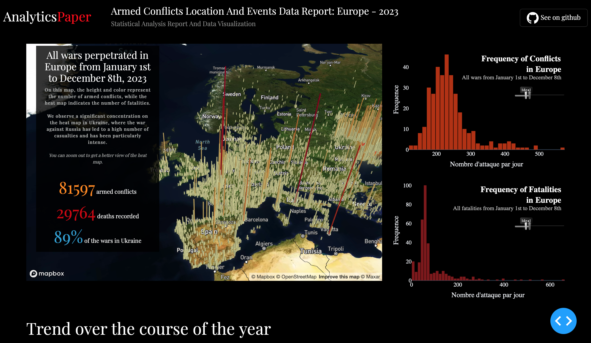

# Armed Conflicts Location And Events Data Project: Europe - 2023

## Overview

This project focuses on the statistical analysis of armed conflicts that occurred in Europe during the year 2023. It aims to provide insights into the frequency, types, and geolocation of these conflicts, offering a comprehensive understanding of the regional scenario

## Table of Contents

1. Introduction
2. Key Features
3. Data Sources
4. Installation
5. Usage
6. Contributing
7. Deployment
8. Go live

## Introduction

The Armed Conflicts Location and Events Data Project is designed to explore and visualize armed conflicts in Europe during the year 2023. This README serves as a guide for users and contributors, providing information on data sources, installation, usage, and more

## Key Features

* Analysis of armed conflicts by disorder type, event type, frequency, and geographical location.
* Interactive visualizations and maps for better comprehension.
* In-depth exploration of conflict trends throughout the year
* And more...

## Data Sources

The project utilizes data from [ACLED](https://acleddata.com/data-export-tool/), providing a comprehensive dataset on armed conflicts in the world. The data is processed and analyzed to generate meaningful insights.

The Armed Conflict Location & Event Data Project (ACLED) is a disaggregated data collection, analysis, and crisis mapping project. ACLED collects information on the dates, actors, locations, fatalities, and types of all reported political violence and protest events around the world.

## Installation

To run this project locally, follow these steps:

1. Clone the repository: `git clone https://github.com/your-username/armed-conflicts-project.git`
2. Navigate to the project directory: `cd armed-conflicts-project`
3. Install dependencies: `pip install -r requirements.txt`
4. Run the project: `python main.py`

View the app by visiting the url displayed in the console in your web browser.

`Note`: This project requires a mapbox token that can be created from a free mapbox account at [https://www.mapbox.com/](https://www.mapbox.com/).

To run this app you must either:

* Create an environment variable named  `MAPBOX_TOKEN` that is set to your token string.
* Create a file named `.mapbox` in the top-level project directory containing your token

## Usage

After installation, access the project through your preferred web browser. Explore the interactive visualizations and gain insights into the armed conflicts in Europe during 2023

## Contributing

If you wish to contribute to this project, follow these steps:

1. Fork the repository.
2. Create a new branch: `git checkout -b feature-name`
3. Make your changes and commit: `git commit -m 'Add feature-name'`
4. Push to the branch: `git push origin feature-name`
5. Create a pull request.

Or contact me directly by sending a message on [LinkedIn](https://www.linkedin.com/in/chris-baudelaire-k-8284731a1/)

## Deployment

You can deploy this app if you want with:

* [Render.com](https://render.com/)
* [Heroku](https://www.heroku.com/)

These are the most easy way to deploy a dash app
You can see the video of Adam Shroeder to learn how to deploy a dash app

## Go Live

Check it out [here](https://armed-conflicts-location-and-events-6g5g.onrender.com)
